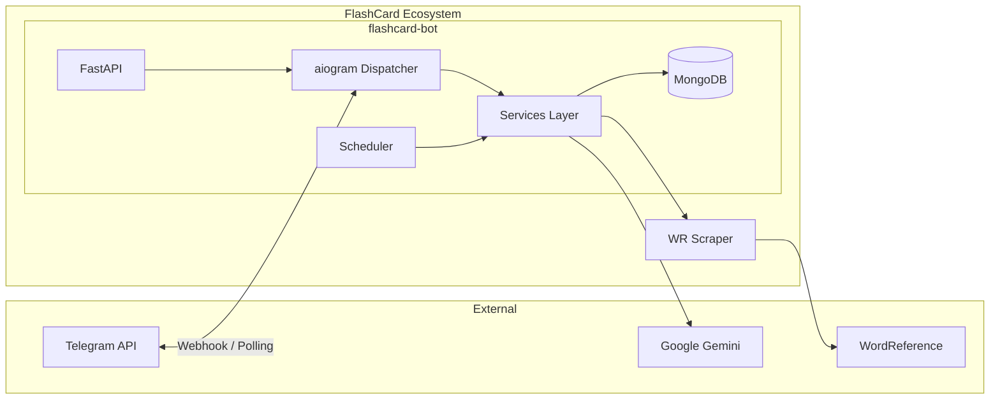
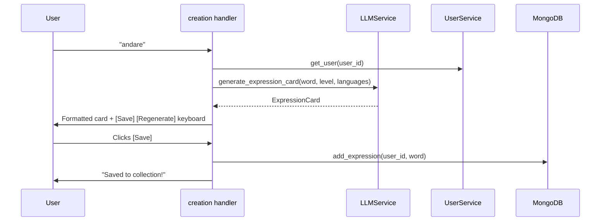
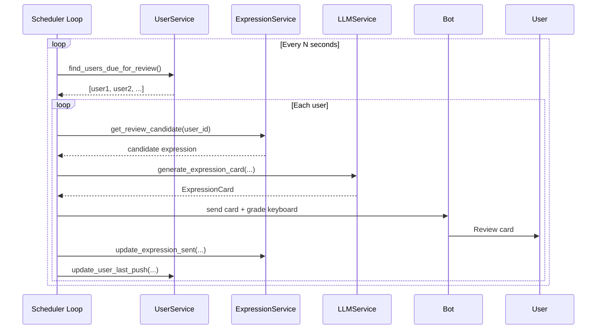
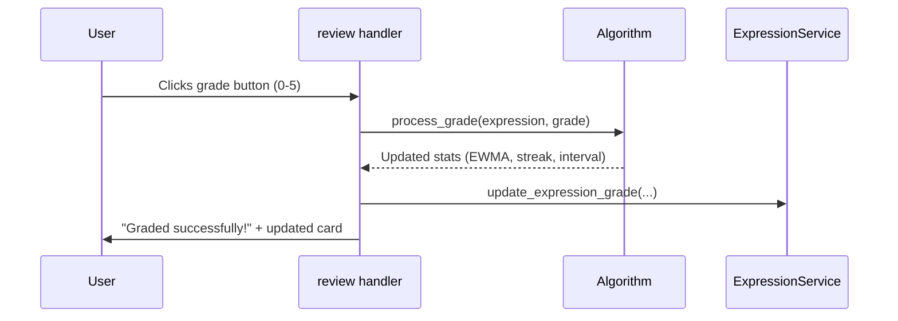

# Architecture

This document describes the system architecture of the FlashCard Bot ecosystem.

## System Overview



## Package Structure

```
flashcard-project/src/flashcard/
├── __main__.py              # Entry points (main, dev, poll modes)
├── settings.py              # Pydantic settings (env vars)
│
├── api/                     # FastAPI layer
│   ├── main.py              # App factory & lifespan
│   ├── lifecycle/           # Startup & shutdown hooks
│   ├── routes/              # HTTP endpoints (health, webhook)
│   └── schemas/             # API request/response models
│
├── db/                      # Database
│   └── mongo.py             # MongoDB connection management
│
├── scheduler/               # Background scheduler
│   └── scheduler.py         # Periodic review push loop
│
├── schemas/                 # Shared data models
│   ├── defaults.py          # Centralized constants
│   ├── user.py              # UserDB model
│   ├── expression.py        # ExpressionDB / ExpressionCard
│   ├── languages.py         # Language codes, levels, flags
│   ├── conjugations.py      # Verb conjugation models
│   ├── story.py             # Story response model
│   └── import_model.py      # Import parsing model
│
├── services/                # Business logic
│   ├── expression.py        # CRUD + review candidate selection
│   ├── user.py              # User CRUD + settings
│   ├── verb.py              # Verb lookup (DB cache + scraper API)
│   ├── i18n.py              # Internationalization (JSON locale files)
│   ├── http_client.py       # Shared httpx client
│   ├── llm/                 # LLM integration
│   │   ├── llm.py           # LLMService (card gen, stories, import parsing)
│   │   ├── llm_key.py       # API key resolution
│   │   └── prompts.py       # System prompts & function declarations
│   └── algorithm/           # Spaced repetition
│       ├── priority.py      # Review priority calculation
│       └── grading.py       # Grade processing & scheduling
│
├── telegram/                # Telegram bot layer
│   ├── bot.py               # Bot & dispatcher setup, service wiring
│   ├── keyboards.py         # Reply keyboard builder
│   ├── handlers/            # Command, callback & message handlers
│   ├── helpers/             # Telegram-specific utilities
│   │   └── card_generator.py
│   ├── ui/                  # Message formatters
│   │   ├── expression.py    # Review card formatting
│   │   ├── expression_lists.py
│   │   ├── verb.py          # Verb conjugation formatting
│   │   ├── story.py         # Story formatting
│   │   └── factories/       # Callback data factories
│   └── states/              # FSM state definitions
│
├── utils/                   # General utilities
│   ├── logger.py            # Logging setup
│   └── time.py              # UTC time helpers
│
└── resources/               # Static resources
    └── locales/
        └── en.json          # English UI strings
```

## Data Flow

### Card Creation (User sends a word)



### Scheduled Review



### Review Grading



## Router Registration Order

Routers are registered in strict priority order. **The first matching handler wins** — later routers are never checked for that update.

| Priority | Module | Handles | Why this position |
|----------|--------|---------|-------------------|
| 1 | `user_settings` | Settings FSM states | FSM states must be checked first |
| 2 | `feedback` | `/feedback` + FSM | FSM takes priority over commands |
| 3 | `reply_commands` | Reply keyboard text | Text-to-command mapping before other text handlers |
| 4 | `start` | `/start`, `/help` | Core commands |
| 5 | `review` | `/get` + grade callbacks | Domain feature |
| 6 | `verb` | `/verb` + conjugation callbacks | Domain feature |
| 7 | `story` | `/story` | Domain feature |
| 8 | `collection` | `/import`, `/list_my_flashcards` | Domain feature |
| 9 | `unknown` | `F.text.startswith("/")` | Catches unrecognized `/commands` |
| 10 | `creation` | `F.text` (any plain text) | Broadest text catch-all |
| 11 | `errors` | Unhandled errors | Last resort |

> [!IMPORTANT]
> The `unknown` router **must** come after all command routers (5–8) but before `creation`. Otherwise it would intercept valid commands like `/verb` as "unknown".

## Bot Initialization

The bot supports two modes:

| Mode | Entry Point | How it works |
|------|-------------|--------------|
| **FastAPI + Webhook** | `flashcard-bot` / `flashcard-bot-dev` | FastAPI app with webhook endpoint, uvicorn server |
| **Standalone Polling** | `flashcard-bot-poll` / `flashcard-bot-dev-poll` | Direct `dp.start_polling()`, no HTTP server |

Both modes initialize the same services and scheduler. The difference is how Telegram updates arrive (webhook POST vs long polling).

## Dependency Injection

Services are injected into handlers via aiogram's middleware system. In `bot.py`, services are passed as keyword arguments to `dp.start_polling()` (or set on the dispatcher for webhook mode). aiogram automatically provides these to handler functions that declare matching parameter names:

```python
# In bot.py
dp.start_polling(bot, expression_service=expression_service, user_service=user_service, consumption_service=consumption_service, ...)

# In any handler — aiogram injects automatically by parameter name
async def cmd_get(message: Message, expression_service: ExpressionService, user_service: UserService, consumption_service: ConsumptionService):
    ...
```

## Database Collections

| Collection | Schema | Purpose |
|------------|--------|---------|
| `users` | `UserDB` | User profiles, settings, scheduling state |
| `expressions` | `ExpressionDB` | Saved flashcards with review stats |
| `conjugations` | — | Cached verb conjugation data |
