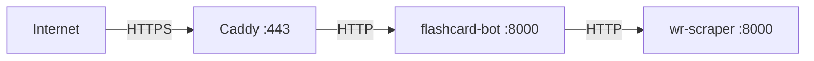

# Configuration Reference

Complete reference for all configuration variables and runtime settings.

## Environment Variables

All variables are loaded by [`settings.py`](../src/flashcard/settings.py) using Pydantic Settings. Copy [`.env.example`](../../.env.example) and fill in your values.

### Telegram Bots

| Variable | Required | Description | Example |
|----------|----------|-------------|---------|
| `BOT_TOKEN` | ✅ | Main bot token from [@BotFather](https://t.me/BotFather) | `123456:ABC-DEF` |
| `LOGGER_BOT_TOKEN` | ✅ | Separate bot for admin notifications/errors | `789012:GHI-JKL` |
| `ADMIN_ID` | ✅ | Telegram user ID to receive admin messages | `123456789` |

> [!NOTE]
> The logger bot is a separate Telegram bot that sends error reports, scheduler metrics, and admin notifications. It must be a different bot from the main one.

### Webhook

| Variable | Required | Description | Example |
|----------|----------|-------------|---------|
| `WEBHOOK_BASE` | Webhook mode | Public HTTPS URL for webhook mode | `https://bot.kartino.it` |
| `WEBHOOK_PATH` | Webhook mode | Path for webhook endpoint | `/webhook/telegram/your-random-token` |
| `WEBHOOK_SECRET` | Webhook mode | Secret token for webhook verification | `your_secret_here` |

> [!TIP]
> Webhook variables are required only when `TELEGRAM_DELIVERY_MODE=webhook`.

### MongoDB

| `MONGO_URI` | ✅ | MongoDB connection string | `mongodb://localhost:27017` |
| `MONGO_DB` | ✅ | Database name | `flashcard_db` |

> [!TIP]
> The project uses granular MongoDB timeouts (server selection, connect, socket, TLS handshake, and wait queue) to prevent long stalls while still allowing retries during failovers.
| `COLLECTION_USERS` | ✅ | Users collection name | `users` |
| `COLLECTION_EXPRESSION` | ✅ | Expressions collection name | `expressions` |
| `COLLECTION_CONJUGATION` | ✅ | Conjugations collection name | `conjugations` |

### WR Scraper

| Variable | Required | Description | Example |
|----------|----------|-------------|---------|
| `SCRAPER_API_KEY` | ✅ | API key for WR Scraper authentication | `your_key_here` |
| `SCRAPER_URL` | ✅ | Scraper service URL | `http://wr-scraper` (Docker) or `http://localhost` |
| `SCRAPER_PORT` | ✅ | Scraper service port | `8000` |

### Application

| Variable | Required | Default | Description |
|----------|----------|---------|-------------|
| `TELEGRAM_DELIVERY_MODE` | ❌ | `polling` | Telegram update mode (`polling` or `webhook`) |
| `PORT` | ❌ | `8000` | HTTP server port |
| `IN_DOCKER` | ❌ | `0` | Set to `1` when running in Docker |
| `LOG_LEVEL` | ❌ | `INFO` | Logging level (`DEBUG`, `INFO`, `WARNING`, `ERROR`) |
| `SCHEDULER_CHECK_INTERVAL_SECONDS` | ❌ | `600` | Scheduler loop interval (seconds) |

### Caddy / TLS / Domain

| Variable | Required | Description | Example |
|----------|----------|-------------|---------|
| `DOMAIN` | ✅ | Base domain for the ecosystem | `kartino.it` |
| `ACME_EMAIL` | Recommended | Email for certificate notices | `admin@example.com` |

> [!NOTE]
> The `DOMAIN` variable is used to configure Caddy routes and generate certificates for `kartino.it`, `www.kartino.it`, `bot.kartino.it`, and `app.kartino.it`.

---

## Centralized Defaults

[`schemas/defaults.py`](../src/flashcard/schemas/defaults.py) contains constants used across the codebase:

| Constant | Value | Purpose |
|----------|-------|---------|
| `DEFAULT_LANG_LEVEL` | `"A2-B1"` | Fallback CEFR level for card generation |
| `DEFAULT_LANG_1_CODE` | `"en"` | Fallback primary language code |
| `DEFAULT_LANG_1_LABEL` | `"🇬🇧 EN"` | Fallback primary language flag |
| `DEFAULT_SCHEDULER_INTERVAL_MINUTES` | `30` | Minimum review interval for scheduler query |

---

## Entry Points

Defined in [`pyproject.toml`](../pyproject.toml):

| Command | Function | Description |
|---------|----------|-------------|
| `flashcard-bot` | `__main__:main` | Production — FastAPI + uvicorn; delivery mode selected by `TELEGRAM_DELIVERY_MODE` |
| `flashcard-bot-dev` | `__main__:dev` | Development — FastAPI + uvicorn with reload |
| `flashcard-bot-poll` | `__main__:main_poll` | Deprecated alias for production polling; now delegates to `flashcard-bot` |
| `flashcard-bot-dev-poll` | `__main__:dev_poll` | Development — standalone polling without HTTP server |

> [!TIP]
> For local development, use `flashcard-bot-dev-poll`. It runs polling mode without needing a webhook or public URL.

> [!IMPORTANT]
> In production, always use `flashcard-bot`. Set `TELEGRAM_DELIVERY_MODE=polling` or `webhook` as needed so `/health` and `/health/ready` remain available.

---

## Docker Compose Services

Defined in [`docker-compose.yml`](../../docker-compose.yml):

| `flashcard-bot` | Main bot (FastAPI + aiogram) | 8000 (internal) |
| `wr-scraper` | WordReference conjugation scraper API | 8000 (internal) |
| `caddy` | Reverse proxy with automatic HTTPS | 80, 443 |

### Health Check

The `/health` endpoint is a **liveness** check and always returns `200 OK`.
The `/health/ready` endpoint is a **readiness** check and pings MongoDB.
- **Ready**: Returns `200 OK`.
- **Not ready**: Returns `503 Service Unavailable` if the database is unreachable.

Docker is configured to use `/health` so transient database issues do not restart the container.



---

## Static Web Assets (Submodule)

The landing page and brand assets are managed as a private Git submodule in the [`web/`](../../web/) directory.

| Component | Description |
|-----------|-------------|
| **Repository** | `https://github.com/d-khalang/kartino-web.git` |
| **Path** | Root `web/` directory |
| **Volume** | Mounted to Caddy as `/srv/web:ro` |

### Working with Submodules

To pull the project with all assets:
```bash
git clone --recurse-submodules <repo-url>
```

To update existing submodules:
```bash
git submodule update --init --recursive
```

> [!TIP]
> Changes made inside the `web/` folder must be committed and pushed within the submodule first, then the submodule pointer must be updated in the main repository.
