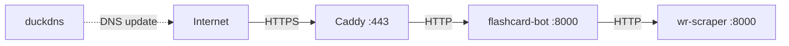

# Configuration Reference

Complete reference for all configuration variables and runtime settings.

## Environment Variables

All variables are loaded by [`settings.py`](../src/flashcard/settings.py) using Pydantic Settings. Copy [`.env.example`](../../.env.example) and fill in your values.

### Telegram Bots

| Variable | Required | Description | Example |
|----------|----------|-------------|---------|
| `BOT_TOKEN` | ✅ | Main bot token from [@BotFather](https://t.me/BotFather) | `123456:ABC-DEF` |
| `LOGGER_BOT_TOKEN` | ✅ | Separate bot for admin notifications/errors | `789012:GHI-JKL` |
| `ADMIN_ID` | ✅ | Telegram user ID to receive admin messages | `123456789` |

> [!NOTE]
> The logger bot is a separate Telegram bot that sends error reports, scheduler metrics, and admin notifications. It must be a different bot from the main one.

### Webhook

| Variable | Required | Description | Example |
|----------|----------|-------------|---------|
| `WEBHOOK_BASE` | ✅ | Public HTTPS URL for webhook mode | `https://flashcard.duckdns.org` |
| `WEBHOOK_PATH` | ✅ | Path for webhook endpoint | `/webhook/telegram` |
| `WEBHOOK_SECRET` | ✅ | Secret token for webhook verification | `your_secret_here` |

> [!TIP]
> Webhook variables are always required by Pydantic validation, but are only _used_ when running in webhook mode. For local development with polling, set them to placeholder values.

### MongoDB

| Variable | Required | Description | Example |
|----------|----------|-------------|---------|
| `MONGO_URI` | ✅ | MongoDB connection string | `mongodb://localhost:27017` |
| `MONGO_DB` | ✅ | Database name | `flashcard_db` |
| `COLLECTION_USERS` | ✅ | Users collection name | `users` |
| `COLLECTION_EXPRESSION` | ✅ | Expressions collection name | `expressions` |
| `COLLECTION_CONJUGATION` | ✅ | Conjugations collection name | `conjugations` |

### WR Scraper

| Variable | Required | Description | Example |
|----------|----------|-------------|---------|
| `SCRAPER_API_KEY` | ✅ | API key for WR Scraper authentication | `your_key_here` |
| `SCRAPER_URL` | ✅ | Scraper service URL | `http://wr-scraper` (Docker) or `http://localhost` |
| `SCRAPER_PORT` | ✅ | Scraper service port | `8000` |

### Application

| Variable | Required | Default | Description |
|----------|----------|---------|-------------|
| `PORT` | ❌ | `8000` | HTTP server port |
| `IN_DOCKER` | ❌ | `0` | Set to `1` when running in Docker |
| `LOG_LEVEL` | ❌ | `INFO` | Logging level (`DEBUG`, `INFO`, `WARNING`, `ERROR`) |
| `SCHEDULER_CHECK_INTERVAL_SECONDS` | ❌ | `600` | Scheduler loop interval (seconds) |

### DuckDNS (Docker only)

| Variable | Required | Description |
|----------|----------|-------------|
| `DUCKDNS_SUBDOMAINS` | Docker only | DuckDNS subdomain(s) |
| `DUCKDNS_TOKEN` | Docker only | DuckDNS authentication token |

---

## Centralized Defaults

[`schemas/defaults.py`](../src/flashcard/schemas/defaults.py) contains constants used across the codebase:

| Constant | Value | Purpose |
|----------|-------|---------|
| `DEFAULT_LANG_LEVEL` | `"A2"` | Fallback CEFR level for card generation |
| `DEFAULT_LANG_1_CODE` | `"en"` | Fallback primary language code |
| `DEFAULT_LANG_1_LABEL` | `"🇬🇧"` | Fallback primary language flag |
| `DEFAULT_SCHEDULER_INTERVAL_MINUTES` | `30` | Minimum review interval for scheduler query |

---

## Entry Points

Defined in [`pyproject.toml`](../pyproject.toml):

| Command | Function | Description |
|---------|----------|-------------|
| `flashcard-bot` | `__main__:main` | Production — FastAPI + uvicorn (webhook-ready) |
| `flashcard-bot-dev` | `__main__:dev` | Development — FastAPI + uvicorn with reload |
| `flashcard-bot-poll` | `__main__:main_poll` | Production — standalone polling (no HTTP server) |
| `flashcard-bot-dev-poll` | `__main__:dev_poll` | Development — standalone polling |

> [!TIP]
> For local development, use `flashcard-bot-dev-poll`. It runs polling mode without needing a webhook or public URL.

---

## Docker Compose Services

Defined in [`docker-compose.yml`](../../docker-compose.yml):

| Service | Purpose | Port |
|---------|---------|------|
| `flashcard-bot` | Main bot (FastAPI + aiogram) | 8000 (internal) |
| `wr-scraper` | WordReference conjugation scraper API | 8000 (internal) |
| `caddy` | Reverse proxy with automatic HTTPS | 80, 443 |
| `duckdns` | Dynamic DNS updater | — |

All services communicate on an internal `bridge` network. Only Caddy exposes ports externally.
