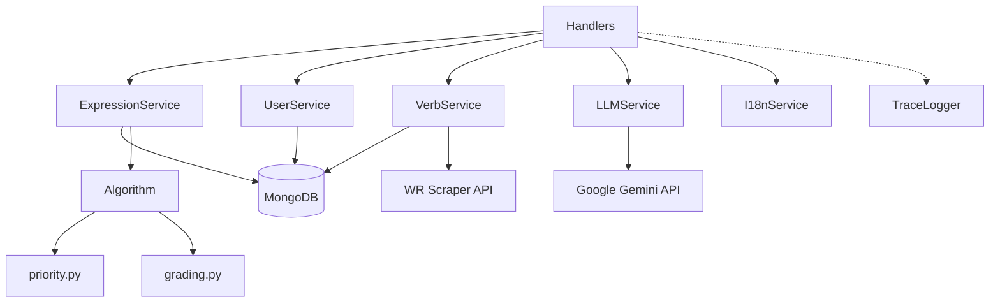
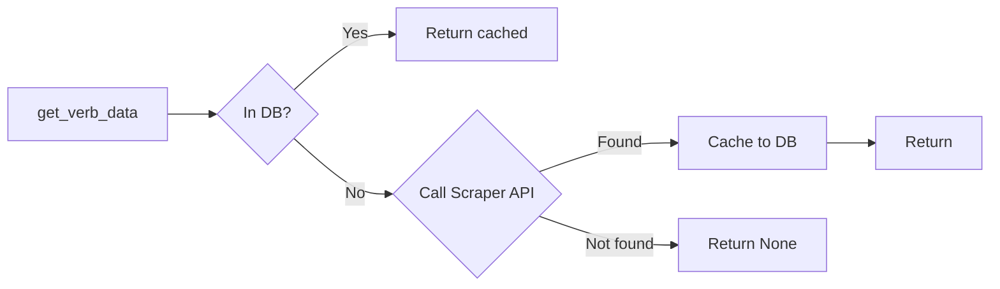

# Services Reference

This document covers the service layer — the business logic behind every bot feature.

## Overview



All services are instantiated in [`bot.py`](../src/flashcard/telegram/bot.py) and injected into handlers via aiogram's DI system. See [Architecture — Dependency Injection](./architecture.md#dependency-injection).

---

## ExpressionService

**File:** [`services/expression.py`](../src/flashcard/services/expression.py)  
**Collection:** `expressions`  
**Dependencies:** `cols` (MongoDB collections dict)

Manages flashcard CRUD and the review candidate selection algorithm.

| Method | Signature | Description |
|--------|-----------|-------------|
| `add_expression` | `(user_id, value) → bool` | Adds expression if not duplicate (case-insensitive). Returns `True` if inserted. Also updates user's `last_push_at` and `has_pending`. |
| `add_expressions_bulk` | `(user_id, expressions) → list[str]` | Bulk insert, skipping duplicates. Returns list of actually inserted values. |
| `get_all_expressions` | `(user_id, sort_by_time=False) → list[str]` | Returns all user expressions. Optional chronological sort. |
| `get_review_candidate` | `(user_id) → dict \| None` | Selects the highest-priority card for review using the SRS algorithm. Filters by 12-hour cooldown. Returns `{doc, direction}`. |
| `update_expression_sent` | `(expression_id, message_id)` | Marks expression as sent with the Telegram message ID. |
| `update_user_last_push` | `(user_id)` | Updates user's `last_push_at` timestamp. |
| `grade_expression` | `(user_id, expression_id, grade, direction="forward")` | Processes a grade (0–5) using the SRS algorithm and updates stats. |

### Review Candidate Selection

The `get_review_candidate` method implements the core spaced repetition logic:

1. **Cooldown filter** — Excludes cards interacted with in the last 12 hours. For cards with no `last_activity_at`, uses `created_at` instead.
2. **Priority scoring** — Each candidate gets a priority score via `calculate_priority()`.
3. **Direction selection** — In `"dual"` review mode, both forward and reverse directions are scored. The highest overall priority wins.

---

## UserService

**File:** [`services/user.py`](../src/flashcard/services/user.py)  
**Collection:** `users`  
**Dependencies:** `cols`

Manages user profiles and settings.

| Method | Signature | Description |
|--------|-----------|-------------|
| `get_user` | `(user_id) → UserDB` | Returns full user document. Creates default if not found. |
| `get_user_status` | `(user_id) → bool` | Returns `True` if user is active. |
| `toggle_active_status` | `(user_id) → bool` | Toggles active/inactive. Returns new status. |
| `update_user_last_push` | `(user_id)` | Updates `last_push_at` timestamp and sets `has_pending=True`. |
| `update_setting` | `(user_id, field, value)` | Updates any single field in the user document (used by settings FSM). |
| `advance_onboarding` | `(user_id, current_step) → bool` | Atomically advances user's onboarding step if it matches `current_step`. |

### UserDB Schema

Defined in [`schemas/user.py`](../src/flashcard/schemas/user.py):

| Field | Type | Default | Description |
|-------|------|---------|-------------|
| `user_id` | `str` | required | Telegram user ID |
| `primary_language` | `LanguageCode` | `"en"` | Translation language |
| `secondary_language` | `LanguageCode?` | `None` | Optional second translation language |
| `target_level` | `LanguageLevel` | `"A2"` | CEFR level (A1–C2) |
| `review_mode` | `str` | `"standard"` | `"standard"` or `"dual"` |
| `review_interval_minutes` | `int` | `30` | Minutes between review batches |
| `is_active` | `bool` | `True` | Whether scheduler sends reviews |
| `has_pending` | `bool` | `False` | Whether user has pending reviews |
| `onboarding_step` | `int` | `0` | Tracks user's progress through contextual onboarding tips |
| `last_push_at` | `str?` | `None` | ISO timestamp of last push |
| `last_reviewed_at` | `str?` | `None` | ISO timestamp of last review |
| `api_config` | `UserAPIConfig?` | `None` | Custom LLM provider/model/key config |
| `consumption` | `UserConsumption` | `{...}` | Nested usage counters (`cards_generated`, etc.) with daily reset |

---

## ConsumptionService

**File:** [`services/consumption.py`](../src/flashcard/services/consumption.py)
**Collection:** `users` (subdocument `consumption`)
**Dependencies:** `cols`

Tracks resource usage (LLM tokens, API calls) with lazy daily resets.

| Method | Signature | Description |
|--------|-----------|-------------|
| `increment` | `(user_id, metric, uses_own_key=False)` | Increments a daily counter. Auto-resets if day changed. |
| `get_consumption` | `(user_id) → UserConsumption` | Returns current usage stats. Auto-resets if stale. |

### Metrics

| Metric | Bucket | Description |
|--------|--------|-------------|
| `cards_generated` | `system_api` / `user_api` | LLM card generations (text→card, regen, /get, scheduled) |
| `stories_generated` | `system_api` / `user_api` | LLM story generations (/story) |
| `verb_lookups` | top-level | Third-party verb scraper calls (always system-side) |

---

## LLMService

**File:** [`services/llm/llm.py`](../src/flashcard/services/llm/llm.py)  
**Dependencies:** Google Gemini API keys (via `LLMKeyProvider`)

Handles all LLM-powered features using Google Gemini with structured JSON output.

| Method | Signature | Description |
|--------|-----------|-------------|
| `generate_expression_card` | `(raw, *, level, lang1_code, lang2_code?, lang1_label, lang2_label?) → ExpressionCard` | Generates a flashcard with definition, translations, and example. |
| `parse_import_list` | `(raw_text) → ImportResponse` | Parses user's bulk import text into structured items. |
| `generate_story` | `(words, target_lang, target_level, story_length) → StoryResponse` | Generates a story incorporating user's vocabulary. |

**Model:** `gemini-2.5-flash-lite`  
**Output:** Structured JSON via `response_schema` parameter  
**Key rotation:** Uses `itertools.cycle` to round-robin between multiple API keys

### Related Files

| File | Purpose |
|------|---------|
| [`llm_key.py`](../src/flashcard/services/llm/llm_key.py) | API key resolution from env vars |
| [`prompts.py`](../src/flashcard/services/llm/prompts.py) | System prompt templates for each LLM task |

---

## TraceLogger

**File:** [`services/trace_logger.py`](../src/flashcard/services/trace_logger.py)  

Writes execution traces to flat files in JSON Lines format for performance monitoring.

| Method | Signature | Description |
|--------|-----------|-------------|
| `log_trace_json` | `(trace_json: str)` | Writes a completed trace JSON line to the active log file asynchronously on a background thread. |
| `shutdown` | `()` | Ensures all pending logs are flushed to disk before application exit. |

Traces are automatically rotated and keep track of latencies, errors, and nested `@observe` spans.

Trace lifecycle finalization is centralized in [`utils/tracing.py`](../src/flashcard/utils/tracing.py) via `finalize_trace(...)`, used by both Telegram update middleware and the scheduler loop.

---

## VerbService

**File:** [`services/verb.py`](../src/flashcard/services/verb.py)  
**Collections:** `conjugation`  
**Dependencies:** `cols`, `http_client` (httpx)

Handles verb conjugation lookup with DB caching.

| Method | Signature | Description |
|--------|-----------|-------------|
| `extract_verb` | `(message_text) → str?` | Extracts verb from `/verb <word>` command text. |
| `is_valid_verb` | `(verb) → bool` | Validates Italian verb format (regex). |
| `get_verb_data` | `(verb) → ConjugationResponse?` | Orchestrates: check DB → check API → cache to DB. |
| `get_verb_from_db` | `(verb) → dict?` | Direct DB lookup. |
| `get_verb_from_api` | `(verb) → ConjugationResponse?` | Calls WR Scraper API. |
| `get_verb_keyboard` | `(data) → InlineKeyboardMarkup` | Builds tense selection keyboard. |

### Lookup Strategy



---

## I18nService

**File:** [`services/i18n.py`](../src/flashcard/services/i18n.py)  
**Resources:** [`resources/locales/en.json`](../src/flashcard/resources/locales/en.json)

Manages bot UI strings with dot-notation key access and variable interpolation.

```python
# Usage examples
i18n.get("commands.start.welcome")                    # Simple key
i18n.get("commands.story.writing", count=5)            # With variable
i18n.get("callbacks.grade.rated", grade="3")           # With formatting
```

**Key format:** `{category}.{subcategory}.{key}` (e.g., `commands.verb.instruction`)

> [!TIP]
> All user-visible strings should go in `en.json`, never hardcoded in handler code. To add a new string, add the key to `en.json` and reference it with `i18n.get("your.key")`.

---

## Algorithm

### Priority Calculation

**File:** [`services/algorithm/priority.py`](../src/flashcard/services/algorithm/priority.py)

The `calculate_priority(stats)` function scores each card for review urgency:

```
Priority = 0.40 × Recency + 0.35 × Difficulty + 0.10 × Stability 
         + 0.05 × Novelty + 0.05 × Lapses + Randomness
```

| Factor | Weight | Formula | Meaning |
|--------|--------|---------|---------|
| Recency | 40% | `t / (1 + t)` where `t` = hours since last interaction | Longer unseen → higher priority |
| Difficulty | 35% | `1 - (ewma_grade / 5)` | Lower grades → higher priority |
| Stability | 10% | `1 / (1 + streak)` | Shorter streak → higher priority |
| Novelty | 5% | `1` if zero reps, else `0` | New cards get a boost |
| Lapses | 5% | `min(lapses, 5) / 5` | More failures → higher priority |
| Randomness | ~4% | `random() × 0.08` | Breaks ties, adds variety |

### Grade Processing

**File:** [`services/algorithm/grading.py`](../src/flashcard/services/algorithm/grading.py)

The `calculate_new_stats(stats, grade, is_reverse=False)` function updates SRS stats after a grade:

- **EWMA grade:** `α × grade + (1-α) × previous` where α = 0.30
- **Success:** grade ≥ 3 → increment reps, extend streak
- **Failure:** grade < 3 → increment lapses, reset streak

---

## Centralized Constants

**File:** [`schemas/defaults.py`](../src/flashcard/schemas/defaults.py)

| Constant | Value | Used by |
|----------|-------|---------|
| `DEFAULT_LANG_LEVEL` | `"A2-B1"` | Review card generation, scheduler |
| `DEFAULT_LANG_1_CODE` | `"en"` | Fallback language code |
| `DEFAULT_LANG_1_LABEL` | `"🇬🇧 EN"` | Fallback language flag |
| `DEFAULT_SCHEDULER_INTERVAL_MINUTES` | `30` | Scheduler review cutoff |
